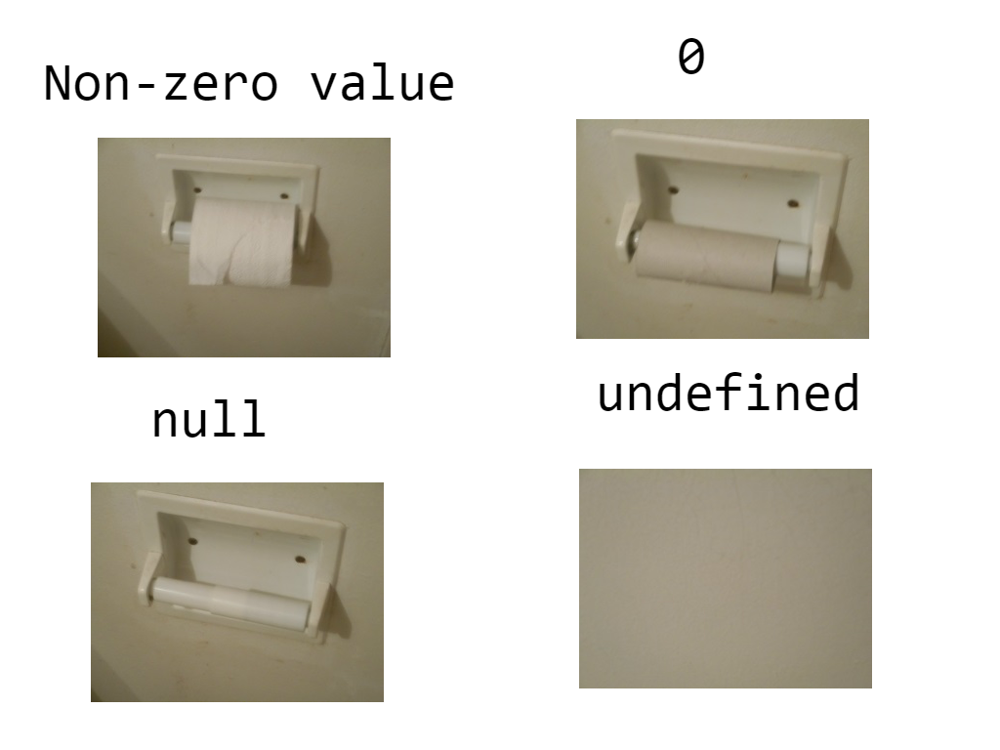

### 变量类型

**基本类型**（基本数值、基本数据类型）是一种既非[对象](https://developer.mozilla.org/zh-CN/docs/Glossary/Object)也无[方法](https://developer.mozilla.org/zh-CN/docs/Glossary/Method)的数据，有以下 7 种基本类型：

`string`、`number`、`bigint`、`boolean`、`null`、`undefined`、`symbol`

基本类型是不可变的（immutable），值传递

还有一种特殊的类型 [object](https://javascript.info/object)，是可变的


#### Object

https://javascript.info/object

**Computed properties**：We can use square brackets in an object literal, when creating an object. That’s called *computed properties*. For instance:

```javascript
let fruit = prompt("Which fruit to buy?", "apple"); // 一个弹窗

let bag = {
  [fruit]: 5, // the name of the property is taken from the variable fruit
};

alert( bag.apple ); // 5 if fruit="apple"
```

What we’ve studied in this chapter is called a “**plain object**”, or just `Object`.

There are many other kinds of objects in JavaScript:

- `Array` to store ordered data collections,
- `Date` to store the information about the date and time,
- `Error` to store the information about an error.
- …And so on.

Sometimes people say something like “Array type” or “Date type”, but formally **they are not types of their own, but belong to a single “object” data type**. And they extend it in various ways.


#### 数据类型的判断

**typeof**：获取变量的类型，7 种基本类型 + "`function`" + "`object`"

**instanceof**：用于检测构造函数的 `prototype` 属性是否出现在某个实例对象的原型链上，[参考](https://developer.mozilla.org/zh-CN/docs/Web/JavaScript/Reference/Operators/instanceof)

```javascript
function Car(make, model, year) {
  this.make = make;
  this.model = model;
  this.year = year;
}
const auto = new Car('Honda', 'Accord', 1998);

console.log(auto instanceof Car);
// expected output: true

console.log(auto instanceof Object);
// expected output: true
```

> 需要注意的是，如果表达式 `obj instanceof Foo` 返回 `true`，则并不意味着该表达式会永远返回 `true`，因为 `Foo.prototype` 属性的值有可能会改变，改变之后的值很有可能不存在于 `obj` 的原型链上，这时原表达式的值就会成为 `false`

**constructor**：查看某个实例的构造函数。函数的默认 prototype 属性是一个对象， `{ constructor: f Rabbit() }`

有几个需要注意的地方：[参考](https://www.cnblogs.com/onepixel/p/5126046.html)

+ `null` 和 `undefined` 是无效的对象，因此是不会有 constructor 存在的，这两种类型的数据需要通过其他方式来判断。

+ 函数的 constructor 是不稳定的，这个主要体现在自定义对象上，当开发者重写 prototype 后，原有的 constructor 引用会丢失，为了规范开发，在重写对象原型时一般都需要重新给 constructor 赋值，以保证对象实例的类型不被篡改。

**Object.prototype.toString.call(obj)**  

```javascript
Object.prototype.toString.call('') ;   // [object String]
Object.prototype.toString.call(1) ;    // [object Number]
Object.prototype.toString.call(true) ; // [object Boolean]
Object.prototype.toString.call(Symbol()); //[object Symbol]
Object.prototype.toString.call(undefined) ; // [object Undefined]
Object.prototype.toString.call(null) ; // [object Null]
Object.prototype.toString.call(new Function()) ; // [object Function]
Object.prototype.toString.call(new Date()) ; // [object Date]
Object.prototype.toString.call([]) ; // [object Array]
Object.prototype.toString.call(new RegExp()) ; // [object RegExp]
Object.prototype.toString.call(new Error()) ; // [object Error]
Object.prototype.toString.call(document) ; // [object HTMLDocument]
Object.prototype.toString.call(window) ; //[object Window]
```


#### null, undefined, NaN

`undefined` means a variable has been declared but has not yet been assigned a value,  used as the default value of variables until they're assigned some other value

`null` is an assignment value. It can be assigned to a variable as a representation of no value

`NaN` - "not a valid number" usually after you did some operation that should produce one but couldn't

```javascript
var testVar;
alert(testVar); //shows undefined

var testVar = null;
alert(testVar); //shows null

null === undefined // false
null == undefined  // true

NaN == null       // false
NaN == undefined  // false
// In JavaScript, a double equals tests for loose equality and preforms type coercion. This means we compare two values after converting them to a common type.
```



#### ==, ===

The `==` operator will compare for equality *after doing any necessary type conversions*. 

The `===` operator will **not** do the conversion, so if two values are not the same type `===` will simply return `false`. 

```javascript
0 == ''             // true
0 == '0'            // true

false == 'false'    // false
false == '0'        // true

[1, 2] == '1, 2'    // false
[1, 2] == '1,2'     // true, [1, 2].toString() >>> '1,2'

false == undefined  // false
false == null       // false
false == NaN        // false
null  == NaN        // false
/*
    if (!a) {
        // `a` is falsey, which includes `undefined` and `null`
        // (and `""`, and `0`, and `NaN`, and [of course] `false`)
    }
    falsey 不等价于 false，有些东西是 falsey 的，但并不意味着这些东西 == false
*/

null == undefined   // true

' \t\r\n ' == 0     // true
```


### 变量定义

如果直接给变量赋值，那这个变量是全局变量

```javascript
+function() {n = 1}() // IIFE 立即执行，还可以加 - ，!，()

console.log(n) // 1
```

#### var

`var` 比较古老，现在很少用，具有以下特性：

+ **不支持块作用域**：要么是函数作用域，要么是全局作用域
+ **允许重复声明**：可以重复声明，最后一次声明会覆盖前一次
+ 变量提升的时候会初始化为 `undefined`

```javascript
console.log(x);      // undefined
if (true) {
    var x = 10
    console.log(x);  // 10
    var x = 20
}
console.log(x);      // 20
```

#### let，const

`let` 和 `const` 具有以下特性：

+ 支持块作用域

+ 不允许重复声明

+ 变量提升的时候不会初始化为 `undefined`，直接使用会报错，不同的环境报不同的错

    

    有的是 `Cannot access before initialization`

    在进入作用域创建变量，到变量可以被访问之间的这一段时间，称为 **“暂时性死区”**（ temporal dead zone，简称 **TDZ**）

在JS引擎扫描代码发现变量声明时，遇到var声明就提升到作用域顶部，遇到let和const就把这些声明放在暂时性死区。对于let和const变量，如果在执行它们的声明语句之前访问会报错，只有执行完声明语句之后才会从暂时性死区移出。

#### 变量提升（Hoist）

函数、变量、类的声明都会发生 [Hoisting](https://developer.mozilla.org/en-US/docs/Glossary/Hoisting)，但只有用 `var` 和 `function` 会自动初始化：

> ver 为初始化 `undefined`
>
> 函数声明 `function foo(){...}`，会在内存里创建函数对象，并且直接初始化为该函数对象。

[Function expressions](https://developer.mozilla.org/en-US/docs/Web/JavaScript/Reference/Operators/function) 和 [Class expressions](https://developer.mozilla.org/en-US/docs/Web/JavaScript/Reference/Classes#class_expressions) 不会被 hoisted

```javascript
console.log(notHoisted)   // undefined
                          // though the variable name is hoisted, the definition isn't.
notHoisted();             // TypeError: notHoisted is not a function
var notHoisted = function() {
   console.log('bar');
};


const p = new Rectangle(); // ReferenceError
class Rectangle {}
```


#### IIFE

以前只有 `var`，不支持块级作用域的时候，使用了一个技巧（immediately-invoked function expressions，简称 IIFE）来模拟块级作用域。

*So, the parentheses around the function is a trick to show JavaScript that the function is created in the context of another expression, and hence it’s a **Function Expression: it needs no name and can be called immediately.*** —— [参考](https://javascript.info/var)

一个 `Function` 作为一个函数是要有名字的，如果把它变成一个表达式（Expression），就能不需要名字立即执行。除了括号之外还有其它方式把函数变成表达式：

```javascript
// Ways to create IIFE (Function expression)

(function() {
  alert("Parentheses around the function");
})();

(function() {
  alert("Parentheses around the whole thing");
}());

!function() {
  alert("Bitwise NOT operator starts the expression");
}();

+function() {
  alert("Unary plus starts the expression");
}();
```

**Let’s note again: nowadays there’s no reason to write such code.** `var` 是历史遗留的老写法，IIFE 是为了解决 `var` 的


### 原型链

当我们访问一个实例 obj 的属性（函数和属性）时，会先从这个实例本身去寻找这个方法，如果没找到就去 `obj.[[Prototype]]` 里面找，以此类推直到访问到 null，[参考](https://javascript.info/prototype-inheritance)

`[[Prototype]]` 指向的是另外一个 `object` ，它是隐藏的内部属性，通过一些方式来访问它：比如 `__proto__`

```javascript
let animal = {
  eats: true
};
let rabbit = {
  jumps: true
};

rabbit.[[Prototype]] = animal; // Uncaught SyntaxError: Unexpected token '['
rabbit.__proto__ = animal;     // sets rabbit.[[Prototype]] = animal
```


用 `__proto__` 访问 `[[Prototype]]` 是一种过时的方法，现在有其它的方式：[参考](https://javascript.info/prototype-methods)

- Object.create(proto, \[descriptors\])：创建一个空对象，设置 `obj.[[Prototype]] = proto` （继承自 `proto`），并设置一些描述符
- Object.getPrototypeOf(obj)：返回 `obj.[[Prototype]]`
- Object.setPrototypeOf(obj, proto)：将 `obj.[[Prototype]]` 设置为 `proto`

```javascript
let animal = {
  eats: true
};

let toy = {
  eats: false
};

// create a new object with animal as a prototype
let rabbit = Object.create(animal);

alert(rabbit.eats); // true

alert(Object.getPrototypeOf(rabbit) === animal); // true

Object.setPrototypeOf(rabbit, toy); // change the prototype of rabbit to toy
```


#### new

除了箭头函数之外，任何函数都可以搭配 **new** 关键字用来构造一个 `object` ，[参考](https://javascript.info/constructor-new)

```javascript
function User(name) {
  // this = {};  (implicitly)

  // add properties and methods to this
  this.name = name;
  this.sayHi = function() {
    alert( "My name is: " + this.name );
  };

  // return this;  (implicitly)
}

new User("123")
```

如果函数中有 `return` 语句，那么有以下规则

- If `return` is called with an object, then the object is returned instead of `this`.
- If `return` is called with a primitive, it’s ignored.

在函数内部，可以通过访问 `new.target` 来判断函数是被常规调用还是搭配 **new** 作为构造器（**constructor**）

```javascript
function User() {
  alert(new.target);
}

// without "new":
User(); // undefined

// with "new":
new User(); // function User { ... }
```


#### F.prototype

每个函数 F 都有一个自带的属性 `prototype`，默认值是一个对象，如下所示：

```javascript
function Rabbit() {}

console.log(Rabbit.prototype) // { constructor: f Rabbit() }
```


我们也可以修改函数的 `prototype` ，当 `new F` 的时候，`F.prototype` 会被赋值到新建的 `object.[[Prototype]]`


如果之后 `F.prototype` 改变了（`F.prototype = <another object>`）, 那 `new F` 出来的 `[[Prototype]]` 就会变成新的，原来创建的对象保持不变

```javascript
let animal = {
  eats: true
};

let toy = {
  eats: false
};

function Rabbit(name) {
  this.name = name;
}

Rabbit.prototype = animal;

let rabbit = new Rabbit("White Rabbit"); //  rabbit.__proto__ == animal
alert( rabbit.eats ); // true

Rabbit.prototype = toy;

let rabbit2 = new Rabbit("Toy Rabbit"); //  rabbit.__proto__ == toy
alert( rabbit.eats );  // true
alert( rabbit2.eats ); // false
```


#### Native prototypes


**可以借用一些内置原型的方法**

For instance, if we’re making an array-like object, we may want to copy some `Array` methods to it.

```javascript
let obj = {
  0: "Hello",
  1: "world!",
  length: 2,
};

obj.join = Array.prototype.join;

alert( obj.join(',') ); // Hello,world!
```


#### 优缺点

优点：父类的方法可以共享
缺点：子类实例共享属性，即会相互影响

```javascript
let animal = { 
    age: 1 
}

let mouse = Object.create(animal)
let rabbit = Object.create(animal)

mouse.__proto__.sex = 100 // 改变了 mouse 的原型对象

console.log(animal.sex)  		   // 100，animal 也被改变了
console.log(rabbit.__proto__.sex)  // 100，animal 也被改变了
```


### 函数

#### this

**TL;DR**：**谁调用函数，这个函数中的 `this` 就是谁**。比如：[参考](https://zhuanlan.zhihu.com/p/354848228)

在简单调用中， 非严格模式下指向 ` window `对象；严格模式下为 `undefined`

```js
function normal() {
  console.log(this); // => window {...}
}
normal();

'use strict';
function strictNormal() {
  console.log(this); // => undefined
}
strictNormal();
```

作为某个对象方法调用时，`this` 指向该对象。哪怕调用的方法是写在该对象的原型上，`this` 依然指向该对象

*In a method call, `this` is always the object before the dot.*

```js
let animal = {
  say() {
    console.log(this.name)  // White Rabbit
  }
};

var rabbit = {
  name: "White Rabbit",
  __proto__: animal
}
rabbit.say();
```

普通函数被用作构造函数，用 `new` 关键字构造实例时，`this` 指向新建的实例。

```js
function Normal() {
  console.log(this); // => Normal {}
}
var normal = new Normal();
```


#### call / apply

两者比较类似

+ `func.apply(context, [...args])`：执行一个函数，参数为数组，函数的上下文 `this` 为传入的 `context` 对象
+ `func.call(context, ...args)`：执行一个函数，参数为 *iterable* `args` ，函数的上下文 `this` 为传入的 `context` 对象


#### bind

用法：`func.bind(context, [arg1], [arg2], ...)`：创建一个和 `func` 一样的函数，但是把它的上下文设置为传入的 `context`，如果还传有参数，也同把参数设置好

```javascript
function mul(a, b) {
  return a * b;
}

let double = mul.bind(null, 2);
let triple = mul.bind(null, 3);

alert( double(3) ); // = mul(2, 3) = 6
alert( triple(4) ); // = mul(3, 4) = 12
```

**使用场景**：Usually we apply `bind` to fix `this` for an object method, so that we can pass it somewhere. For example, to `setTimeout`。

如果想固定部分参数，但不固定上下文 `this`，For example, for an object method。

`bind` does not allow that. We can’t just omit the context and jump to arguments。

```javascript
function partial(func, ...argsBound) {
  return function(...args) { // (*)
    return func.call(this, ...argsBound, ...args);
  }
}

// Usage:
let user = {
  firstName: "John",
  say(time, phrase) {
    alert(`[${time}] ${this.firstName}: ${phrase}!`);
  }
};

// add a partial method with fixed time
user.sayNow = partial(user.say, new Date().getHours() + ':' + new Date().getMinutes());

user.sayNow("Hello"); // [10:00] John: Hello!
```


### 词法环境

在 V8 引擎词法分析阶段，有一个词法环境对象 **Lexical Environment** 用来登记执行上下文里的变量

>  词法分析后解析生成AST，最后生成机器码执行

词法环境与我们自己写的代码结构相对应，也就是我们自己代码写成什么样子，词法环境就是什么样子。

> 在代码定义的时候决定的，跟代码在哪里调用没有关系。 [参考](https://limeii.github.io/2019/05/js-lexical-environment/)

词法环境对象由**两部分**组成：

1. 环境记录（Environment Record）：一个存储所有局部变量作为其属性（包括一些其他信息，例如 `this` 的值）的对象。
2. 对 **外部词法环境** 的引用 `outer` ，与外部代码相关联。


比如：

```javascript
function makeCounter() {
  let count = 0;

  return function() {
    return count++;
  };
}

let counter = makeCounter();
```

在每次 `makeCounter()` 调用的开始，都会创建一个新的词法环境对象，以存储该 `makeCounter` 运行时的变量。

因此，我们有两层嵌套的词法环境，就像上面的示例一样：


不同的是，在执行 `makeCounter()` 的过程中创建了一个仅占一行的嵌套函数：`return count++`。

**我们尚未运行它，仅创建了它。所有的函数在“诞生”时都会记住创建它们的词法环境。**

从技术上讲，这里没有什么魔法：所有函数都有名为 `[[Environment]]` 的隐藏属性，该属性保存了对创建该函数的词法环境的引用。


当 `counter()` 执行的时候，


#### 闭包

[阮一峰](https://www.ruanyifeng.com/blog/2009/08/learning_javascript_closures.html)是这么描述的：闭包可以理解成定义在一个函数内部的函数，是将函数内部和函数外部连接起来的一座桥梁。

[javascript.info](https://javascript.info/closure) 上的概括为：指一个函数可以记住其外部变量并可以访问这些变量。

> *A closure is a function that remembers its outer variables and can access them.*

在 JavaScript 中，函数是天生闭包的，因为函数会自动通过隐藏的 `[[Environment]]` 属性记住创建它们的位置，所以它们都可以访问外部变量。


**闭包**的本质是：执行完的 `执行上下文` 被弹出执行栈，它的词法环境处于失联状态，后续的执行上下文没办法直接访问这个失联的词法环境。在这种情况下还保留了对那个词法环境的`引用`，从而可以通过这个`引用`去访问失联的词法环境，这个`引用`就是闭包。

闭包的作用：可以读取函数内部的变量，另一个就是让这些变量的值始终保持在内存中

典型的闭包:  

1. 将函数作为另一个函数的返回值  
2. 将函数作为实参传给另一个函数调用

缺点：函数定义的变量和数据会一直存在内部函数中，容易导致内存泄漏  

```javascript
function f() {
  let value = 123;

  return function() {
    alert(value);
  }
}

let g = f(); 
// g.[[Environment]] stores a reference to the Lexical Environment of the corresponding f() call
```

解决：用完后及时释放

```javascript
g = null; // ...and now the memory is cleaned up
```


### 事件循环

[参考](https://javascript.info/event-loop#macrotasks-and-microtasks)；[HTML 标准](https://html.spec.whatwg.org/multipage/webappapis.html#event-loops)；[视频](https://www.youtube.com/watch?v=8aGhZQkoFbQ)

Immediately after every **macrotask**, the engine executes all tasks from **microtask** queue, prior to running any other macrotasks or rendering or anything else.

The richer event loop picture looks like this (order is from top to bottom, that is: the script first, then microtasks, rendering and so on):


All microtasks are completed before any other event handling or rendering or any other macrotask takes place.

That’s important, as it guarantees that **the application environment is basically the same** (no mouse coordinate changes, no new network data, etc) **between microtasks.**

#### MicroTasks

They are usually created by promises: an execution of `.then/catch/finally` handler becomes a microtask. Microtasks are used “under the cover” of `await` as well, as it’s another form of promise handling.

There’s also a special function `queueMicrotask(func)` that queues `func` for execution in the microtask queue.

#### MacroTasks

setTimeout，Scripts，Events

#### Queue

An [event loop](https://html.spec.whatwg.org/multipage/webappapis.html#event-loop) has one or more task queues. A [task queue](https://html.spec.whatwg.org/multipage/webappapis.html#task-queue) is a [set](https://infra.spec.whatwg.org/#ordered-set) of [tasks](https://html.spec.whatwg.org/multipage/webappapis.html#concept-task).

> [Task queues](https://html.spec.whatwg.org/multipage/webappapis.html#task-queue) are [sets](https://infra.spec.whatwg.org/#ordered-set), not [queues](https://infra.spec.whatwg.org/#queue), because [step one of the event loop processing model](https://html.spec.whatwg.org/multipage/webappapis.html#step1) grabs the first [*runnable*](https://html.spec.whatwg.org/multipage/webappapis.html#concept-task-runnable) [task](https://html.spec.whatwg.org/multipage/webappapis.html#concept-task) from the chosen queue, instead of [dequeuing](https://infra.spec.whatwg.org/#queue-dequeue) the first task.
>
> The [microtask queue](https://html.spec.whatwg.org/multipage/webappapis.html#microtask-queue) is not a [task queue](https://html.spec.whatwg.org/multipage/webappapis.html#task-queue).

#### 流程

1. 执行一个宏任务（栈中没有就从事件队列中获取）
2. 执行过程中如果遇到微任务，就将它添加到微任务的任务队列中
3. 宏任务执行完毕后，立即执行当前微任务队列中的所有微任务（依次执行）
4. 当前宏任务执行完毕，开始检查渲染，然后GUI线程接管渲染
5. 渲染完毕后，JS线程继续接管，开始下一个宏任务（从事件队列中获取，也就是 callbacke queue）


To schedule a new *macrotask*:

- Use zero delayed `setTimeout(f)`.

That may be used to split a big calculation-heavy task into pieces, for the browser to be able to react to user events and show progress between them.

Also, used in event handlers to schedule an action after the event is fully handled (bubbling done).

To schedule a new *microtask*

- Use `queueMicrotask(f)`.
- Also promise handlers go through the microtask queue.

There’s no UI or network event handling between microtasks: they run immediately one after another.

So one may want to `queueMicrotask` to execute a function asynchronously, but within the environment state.


>   宏任务（macrotasks）:  主js、UI渲染、setTimeout、setInterval、setImmediately、requestAnimationFrame、I/O等  
>
> 微任务（microtasks）：process.nextTick()、promise.then()（new Promise不算！）、Object.observe()等 


### Promise

我的理解：本质上是对操作的封装，操作用来产生结果，传入的调用则消费这个结果

https://javascript.info/async

```javascript
let promise = new Promise(function(resolve, reject) {
  // executor
});
```

Its arguments `resolve` and `reject` are callbacks provided by JavaScript itself. Our code is only inside the executor.

- `resolve(value)` — if the job is finished successfully, with result `value`
- `reject(error)` — if an error has occurred, `error` is the error object

promise.then 返回一个promise，我们可以把 then 串起来，让代码变得扁平，在按顺序处理具有依赖关系的业务时，就不再需要反复地嵌套回调函数，反复的嵌套错误处理（ “callback hell” or “pyramid of doom.”）

```javascript
loadScript('1.js', function(error, script) {
  if (error) {
    handleError(error);
  } else {
    // ...
    loadScript('2.js', function(error, script) {
      if (error) {
        handleError(error);
      } else {
        // ...
        loadScript('3.js', function(error, script) {
          if (error) {
            handleError(error);
          } else {
            // ...continue after all scripts are loaded (*)
          }
        });

      }
    });
  }
});
```


使用 `then` 捕获成功和失败的情况，第二个函数可以为空，`then` 返回的 promise 装载了由调用返回的值

```javascript
promise.then(
  function(result) { /* handle a successful result */ },
  function(error) { /* handle an error */ }
);
```

使用 `reject` 专门捕获失败情况

包含了更好的错误处理方式，在异步回调中，函数的执行栈与原函数分离开，导致外部无法抓住异常，使用 `catch` 将其捕获，


Promise 是一种更良好的编程风格  

存在的缺点：

+ 一旦开始执行，中途无法取消
+ 如果不设置回调函数，Promise 内部抛出的错误，不会反应到外部
+ 处于pendding 状态时，无法得知进展到哪一个阶段（刚刚开始还是即将完成）


以下两种写有什么区别

```javascript
promise.then(f1).catch(f2);  // （*）
promise.then(f1, f2);        // （**）
```

> 当 `f1` 里面出错了，（*）能捕获，（**）不能

#### async / await  

定义函数时加了 `async` 关键字的话，这个函数返回的是一个 Promise 对象，可以用 `.then`

`await` 关键字只能用在 `async` 定义的函数内；  

await 可以用于等待一个 async 函数的返回值，如果它等到的是一个 Promise 对象，await 就忙起来了，它会阻塞后面的代码，等着 Promise 对象 resolve，然后得到 resolve 的值，作为 await 表达式的运算结果。  

async/await 使得异步代码看起来像同步代码，使代码简洁，可读性更好，避免嵌套。  

```js
async function async1() {
	console.log('async1 start');
	await async2();
	console.log('async1 end');
}

等价于

async function async1() {
	console.log('async1 start');
	Promise.resolve(async2()).then(() => {
        console.log('async1 end');
    })
}
```

#### all

The new promise resolves when all listed promises are resolved, and the array of their results becomes its result. [参考](https://javascript.info/promise-api)

```javascript
Promise.all([
  new Promise(resolve => setTimeout(() => resolve(1), 3000)), // 1
  new Promise(resolve => setTimeout(() => resolve(2), 2000)), // 2
  3  // 3 ，allows non-promise “regular” values in iterable
])
.then(alert); // 1,2,3 when promises are ready: each promise contributes an array member
```

If any of the promises is rejected, the promise returned by Promise.all **immediately rejects with that error**. **[ all or nothing ]**

```javascript
Promise.all([
  new Promise((resolve, reject) => setTimeout(() => resolve(1), 1000)),
  new Promise((resolve, reject) => setTimeout(() => reject(new Error("Whoops!")), 2000)),
  new Promise((resolve, reject) => setTimeout(() => resolve(3), 3000))
])
.catch(alert); // Error: Whoops!
```


### ES6 的新特性 

**新的变量声明**：let，const

**新的语法**：[参考](https://juejin.cn/post/6844903618810757128)

+ 模板字符串

  ```javascript
  let name = "kris"
  let str = `字符 ${name} 串`
  ```

+ 对象，数组解构

  ```javascript
  const {  } = obj
  const [  ] = arr
  ```

+ 展开操作符

  ```javascript
  let arr = [1,2,3];
  console.log(...arr);
  
  function foo(...args) {
    console.log(args);
  }
  
  foo( 1, 2, 3, 4, 5);
  ```

+ 箭头函数：箭头函数表达式的语法比函数表达式更简洁

  + 没有自己的`this`，外共用部非箭头函数的 `this`，适合作为回调函数

  + 没有 `prototype` 属性，不能用作构造函数（不能 new）

  + 没有 `arguments`，可以通过 [剩余参数语法](https://link.zhihu.com/?target=https%3A//developer.mozilla.org/zh-CN/docs/Web/JavaScript/Reference/Functions/Rest_parameters) 获取到全部参数

    ```javascript
    const arrow = (...arg) => {
      console.log(arg); // => [1, [1, 2], [1, 2, 3]]
    }
    arrow(1, [1, 2], [1, 2, 3]);
    ```

+ 函数默认值

**新的功能：**

+ ```javascript
  let stus = ['Sam', '22', '男'];
  
  for (let stu in stus) {
    console.log(stu);
  } // 0，1，2；遍历 key
  
  for (let stu of stus) {
    console.log(stu);
  } // Sam，22，男；遍历 value
  ```

  ```javascript
  let animal = {
    eats: true
  };
  
  let rabbit = {
    jumps: true,
    __proto__: animal
  };
  
  // for..in 遍历包括继承属性
  for(let prop in rabbit) alert(prop); // jumps, eats
  ```

  

+ Class：不是新的对象继承模型，只是原型链的语法糖表现形式

+ Set：里面的元素不重复，用于数组去重

+ Symbol：独一无二的对象，可以在 object 中添加一些隐藏属性，不用担心之后被重写覆盖

#### Generator

迭代器：元素只有在被需要的时候才产生，无限序列的生成

```javascript
function *fibonacci() {
    let a = 0, b = 1, c;
    while (true) {
        yield a
        c = a
        a = b
        b = a + c
    }
}

let fib = fibonacci()
for(let i = 0; i < 10; i++) {
    console.log(fib.next().value);
}
```


#### Proxy

A `Proxy` object wraps another object and intercepts operations, like reading/writing properties and others, optionally handling them on its own, or transparently allowing the object to handle them. [参考](https://javascript.info/proxy)

对一个实例的封装，里面可以做一些类似于装饰器的动作。在业务和实例之间加了一层。


### 对象拷贝

[参考](https://www.freecodecamp.org/news/copying-stuff-in-javascript-how-to-differentiate-between-deep-and-shallow-copies-b6d8c1ef09cd/)

**浅拷贝**（Shallow）：不会克隆嵌套的属性

+ Spread operator：`let a = {...b}`
+ `Object.assign`：`let b = Object.assign({}, a)`，复制一个跟 a 一样的，放到第一个参数 （可以是`{}`）中，再返回出来

+ 对于数组来说，有一些内置方法会返回一个新数组：`map`，`filter`，`reduce`，`slice`，也能起到浅拷贝的效果


**深拷贝**：把嵌套的属性一起

+ 借助 `Json` 转换，会丢失方法
+ 手动递归复制


### 事件委托

事件冒泡和事件捕获分别由微软和网景公司提出，这两个概念都是为了解决页面中事件流（事件发生顺序）的问题。

事件冒泡：事件会从最内层的元素开始发生，一直向上传播，直到document对象

事件捕获相反

W3C 指定的标准事件流是 **先捕获再冒泡**

当我们监听某个元素上的事件时，传递如下参数

```javascript
element.addEventListener(event, function, useCapture)
```

*useCapture*  可选：布尔值（默认是 `false`）， `true` 代表函数在事件捕获阶段执行， `false` 代表函数在事件冒泡阶段执行


**事件委托**：不需要把事件直接监听到每个子元素上，而是可以委托父监听，再通过 `event.target` 得到具体哪个子元素


## Code

### 节流和防抖

是优化高频率执行代码的一种手段，高频事件在触发时，会不断地调用绑定在事件上的回调函数，影响性能

**节流**：一个单位时间内，只能触发一次函数

```javascript
// 节流
function throttle(fn, delay = 1000) {
    // 上依次执行该函数的时间戳
    let previous = 0
    return function (...args) {
        const context = this;
        // 获取当前时间
        const now = new Date();
        // 当前时间 - 上依次执行的时间 > 延迟时间，就执行
        if (now - previous > delay) {
            fn.apply(context, args);
            previous = now;
        }
    };
}
```

- 鼠标不断点击触发，mousedown(单位时间内只触发一次)
- 监听滚动事件，比如是否滑到底部自动加载更多，用throttle来判断


**防抖**：n 秒后在执行该事件，若在 n 秒内被重复触发，则重新计时。用户操作定下来了，再去执行

```javascript
// 防抖
function debounce(fn, delay = 500, immediate = true) {
    let timer = null;
    return function (...args) {
        // ...args 是一个数组，里面是传进来的所有的参数
        const context = this;
        // 第一次执行的时候不需要等待
        if (immediate) {
            fn.call(context, ...args);
            // 只会生效一次
            immediate = false
            return
        }
        if (timer) clearTimeout(timer); // 取消上一个在等的
        timer = setTimeout(() => {
            // 下一个等去吧
            fn.call(context, ...args);
        }, delay);
    };
}
```

- search 搜索联想，用户在不断输入值时，用防抖来节约请求资源。
- window 触发 resize 的时候，不断的调整浏览器窗口大小会不断的触发这个事件，用防抖来让其只触发一次

### promisify

```javascript
function promisify(f) {
  return function (...args) { // return a wrapper-function (*)
    return new Promise((resolve, reject) => {
      function callback(err, result) { // our custom callback for f (**)
        if (err) {
          reject(err);
        } else {
          resolve(result);
        }
      }

      args.push(callback); // append our custom callback to the end of f arguments

      f.call(this, ...args); // call the original function
    });
  };
}

// usage:
let loadScriptPromise = promisify(loadScript);
loadScriptPromise(...).then(...);
```


### 深拷贝

```js
// json
function deepclone(obj){
	let _obj = JSON.stringify(obj);
    return JSON.parse(_obj);
}

// 数组 对象区分
function deepclone(obj) {
    let res;
    if (typeof obj ==='Object') {
        if (Array.isArray(obj)) {
            res = []
            for (let i in obj) {
                res.push(deepclone(obj[i]))
            }
        }
        else if (obj === null) {
            res = null
        }
        else if (obj.constructor === 'RegExp') {
            res = obj
        }
        // 普通对象
        else {
            res = {}
            for (let i in obj) {
                res[i] = deepclone(obj[i])
            }
        }
    }
    // 不是对象
    else{
        res = obj
    }
    return res;
}
```

### Cookie 的读写

```javascript
// returns the cookie with the given name, or undefined if not found
function getCookie(name) {
  let matches = document.cookie.match(new RegExp(
    "(?:^|; )" + name.replace(/([\.$?*|{}\(\)\[\]\\\/\+^])/g, '\\$1') + "=([^;]*)"
  ));
  return matches ? decodeURIComponent(matches[1]) : undefined;
}

// set cookie 'name=value' with given options
function setCookie(name, value, options = {}) {

  options = {
    path: '/',
    // add other defaults here if necessary
    ...options
  };

  if (options.expires instanceof Date) {
    options.expires = options.expires.toUTCString();
  }

  let updatedCookie = encodeURIComponent(name) + "=" + encodeURIComponent(value);

  for (let optionKey in options) {
    updatedCookie += "; " + optionKey;
    let optionValue = options[optionKey];
    if (optionValue !== true) {
      updatedCookie += "=" + optionValue;
    }
  }

  document.cookie = updatedCookie;
}

// Example of use:
setCookie('user', 'John', {secure: true, 'max-age': 3600});


// delete cookie by name
function deleteCookie(name) {
  setCookie(name, "", {
    'max-age': -1
  })
}
```

### 装饰器

以下是一个装饰器（Decorator）样例

```javascript
let worker = {
  slow(min, max) {
    alert(`Called with ${min},${max}`);
    return min + max;
  }
};

function cachingDecorator(func, hash) {
  let cache = new Map();
  return function() {
    
    // create a single key from arguments
    let key = hash(arguments); 
    if (cache.has(key)) {
      return cache.get(key);
    }
    
    // "this" is passed to "func"
    let result = func.call(this, ...arguments); 
    // 或者
    let result = func.apply(this, arguments);

    cache.set(key, result);
    return result;
  };
}

function hash() {
  // 借用内置数组的 join 方法，内置的 join 方法是拼接 this："this[0], this[1], ..."
  return [].join.call(arguments); // 或者 Array.prototype.join.call(arguments);
    
  // Error: [].join(arguments) 输出的是空 ""，因为没有指定 this
}

// 或者
// function hash(...args) {
//   return [].join.call(args);
// }

// After the decoration worker.slow is now the wrapper "function (x) { ... }".
worker.slow = cachingDecorator(worker.slow, hash);

// when below is executed, the wrapper gets 3, 5 as arguments and this=worker (it’s the object before dot).
alert( worker.slow(3, 5) );

alert( "Again " + worker.slow(3, 5) ); // same (cached)
```

### bind / call

```javascript
Function.prototype.myCall = function(context) {
    // 给 context 添加一个属性
    context.fn = this;
    let args = [...arguments].slice(1)
    let result = context.fn(...args)
    // 删除刚添加的 fn
    delete context.fn
    return result;
}

Function.prototype.mybind = function(context) {
    var args = [...arguments].slice(1);
    let _func = this
    return function() {
        _func.apply(context, args.concat(...arguments))
    }
}
```

