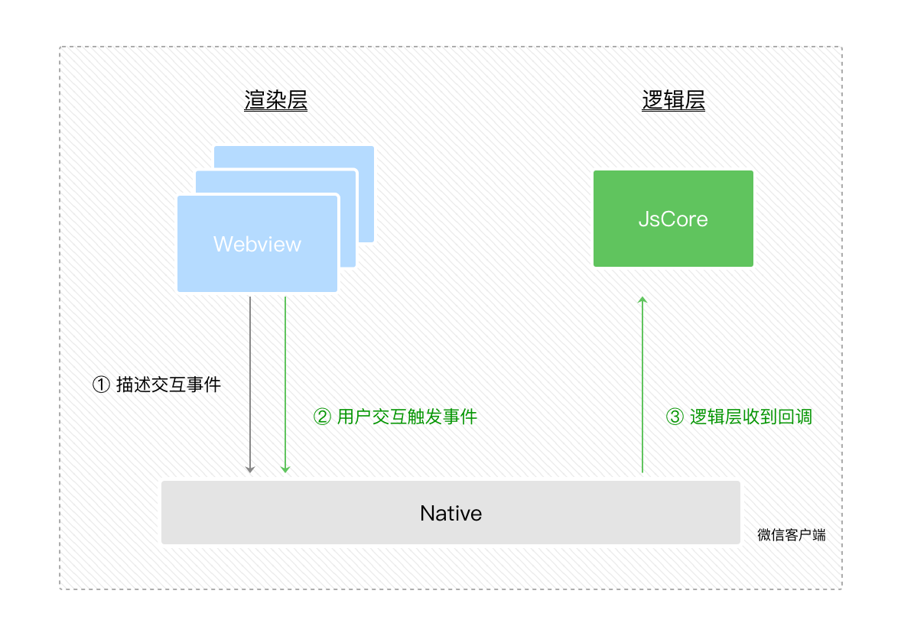

## 问题

小程序和浏览器有什么不同

安卓的 webview 有了解过吗

微信小程序的底层架构


微信小程序开发

+ 微信小程序页面的生命周期
+ 数据是如何绑定的，如何更新到页面上


## WebView

[参考](https://juejin.cn/post/6844904163181232136)


## JSBridge

[参考1](https://juejin.cn/post/6844903585268891662)；[参考2](https://sevody.github.io/2019/11/10/jsbridge-mechanisms/)

JSBridge 简单来讲，主要是 **给 JavaScript 提供调用 Native 功能的接口**，让混合开发中的『前端部分』可以方便地使用地址位置、摄像头甚至支付等 Native 功能。


### Native 调用 Js

就是执行拼接 JavaScript 字符串

从外部调用 JavaScript 中的方法必须在全局的 window 上

**回调**：先将回调存起来，随后取出执行


### Js 调用 Native

JavaScript 调用 Native 的方式，主要有两种：**注入 API** 和 **拦截 URL SCHEME**

+ 注入 API：比如把一个 Java 对象注入到 Js 的 Context 中，也就是 javascript 中的全局 `window` 对象下，js 直接通过 `window` 调用该对象的方法。得注意注入时机
+ Web 端通过某种方式（例如 iframe.src）发送 URL Scheme 请求，之后 Native 拦截到请求并通过约定规则（私有协议）对 URL 进行解析。URL 有长度限制。

**回调**：Js 调用 Native 时将回调函数与一个全局唯一标识 ID 绑定起来，Native 处理完毕后，原封不动的将 ID 传递回 Js，Js 根据 ID 即可找到回调


### JSBridge 使用

实现一个包含协议的拼装 / 发送 / 参数池 / 回调池等一些基础功能的 JSBridge 后，将其**注入**到 Js 执行上下文中，即全局 window 对象

如下所示

```javascript
// WebViewJavascriptBridge_JS.m
window.WebViewJavascriptBridge = {
  registerHandler: registerHandler, // 注册供 Native 调用的 JS 方法
  callHandler: callHandler, // 调用 Native 端的方法
  _fetchQueue: _fetchQueue, // 供 Native 调用，取出 sendMessageQueue 的数据
  _handleMessageFromObjC: _handleMessageFromObjC // 供 Native 调用，把通信消息传给 H5
};

// ...

var sendMessageQueue = []; // 保存要传给 Native 的通信消息
var messageHandlers = {}; // 保存注册的 JS 方法
var responseCallbacks = {}; // 保存回调方法
```

Native 部分也需要实现与 JSBridge 功能映射的代码（SDK）

```objective-c
// WKWebViewJavascriptBridge.m
@interface WKWebViewJavascriptBridge : NSObject<WKNavigationDelegate, WebViewJavascriptBridgeBaseDelegate>
// 注册供 JS 调用的 Native 方法
- (void)registerHandler:(NSString*)handlerName handler:(WVJBHandler)handler;
// 调用 JS 端的方法
- (void)callHandler:(NSString*)handlerName data:(id)data responseCallback:(WVJBResponseCallback)responseCallback;
@end

// WebViewJavascriptBridgeBase.m
- (id)init {
    if (self = [super init]) {
        self.messageHandlers = [NSMutableDictionary dictionary]; // 保存注册的 Native 方法
        self.responseCallbacks = [NSMutableDictionary dictionary]; // 保存回调方法
    }
    // ...
}
```


使用时可以将 JSBridge 和 SDK 两部分封装，由客户端统一引入。客户端在初始化一个 WebView 打开页面时，可以直接注入对应的 JSBridge，两部分代码统一维护，不会出现版本兼容的问题；

> 这里有一点需要注意的是，协议的调用，一定是需要确保执行在bridge.js 成功注入后。由于客户端的注入行为属于一个附加的异步行为，从 H5 方很难去捕捉准确的完成时机，因此这里需要通过客户端监听页面完成后通知 H5，页面中即可通过监听该通知（事件）进行初始化。


## 小程序的双线程模型

得益于客户端系统有JavaScript 的解释引擎（在iOS下是用内置的 JavaScriptCore框架，在安卓则是用腾讯x5内核提供的JsCore环境），我们可以创建一个单独的线程去执行 JavaScript，在这个环境下执行的都是有关小程序业务逻辑的代码，也就是我们前面一直提到的逻辑层。而界面渲染相关的任务全都在WebView线程里执行，通过逻辑层代码去控制渲染哪些界面，那么这一层当然就是所谓的渲染层。这就是小程序双线程模型的由来。

整个小程序框架系统分为两部分：**[逻辑层](https://developers.weixin.qq.com/miniprogram/dev/framework/app-service/)**（App Service）和 **[视图层](https://developers.weixin.qq.com/miniprogram/dev/framework/view/)**（View）。小程序提供了自己的视图层描述语言 `WXML` 和 `WXSS`，以及基于 `JavaScript` 的逻辑层框架，并在视图层与逻辑层间提供了数据传输和事件系统，让开发者能够专注于数据与逻辑。

小程序的渲染层和逻辑层分别由2个线程管理：渲染层的界面使用了WebView 进行渲染；逻辑层采用 [JsCore](https://tech.meituan.com/2018/08/23/deep-understanding-of-jscore.html) 线程运行JS脚本。一个小程序存在多个界面，所以渲染层存在多个WebView线程，这两个线程的通信会经由微信客户端（下文中也会采用Native来代指微信客户端）做中转，逻辑层发送网络请求也经由Native转发，小程序的通信模型下图所示。


### 逻辑层 App Service

小程序开发框架的逻辑层使用 `JavaScript` 引擎为小程序提供开发者 `JavaScript` 代码的运行环境以及微信小程序的特有功能。

逻辑层将数据进行处理后发送给视图层，同时接受视图层的事件反馈。

开发者写的所有代码最终将会打包成一份 `JavaScript` 文件，并在小程序启动的时候运行，直到小程序销毁。这一行为类似 [ServiceWorker](https://developer.mozilla.org/en-US/docs/Web/API/Service_Worker_API)，所以逻辑层也称之为 App Service。

在 `JavaScript` 的基础上，我们增加了一些功能，以方便小程序的开发：

- 增加 `App` 和 `Page` 方法，进行[程序注册](https://developers.weixin.qq.com/miniprogram/dev/framework/app-service/app.html)和[页面注册](https://developers.weixin.qq.com/miniprogram/dev/framework/app-service/page.html)。
- 增加 `getApp` 和 `getCurrentPages` 方法，分别用来获取 `App` 实例和当前页面栈。
- 提供丰富的 [API](https://developers.weixin.qq.com/miniprogram/dev/framework/app-service/api.html)，如微信用户数据，扫一扫，支付等微信特有能力。
- 提供[模块化](https://developers.weixin.qq.com/miniprogram/dev/framework/app-service/module.html#模块化)能力，每个页面有独立的[作用域](https://developers.weixin.qq.com/miniprogram/dev/framework/app-service/module.html#文件作用域)。

**注意：小程序框架的逻辑层并非运行在浏览器中，因此 `JavaScript` 在 web 中一些能力都无法使用，如 `window`，`document` 等。**


### 视图层 View

[渲染层](https://developers.weixin.qq.com/ebook?action=get_post_info&docid=0000286f908988db00866b85f5640a)

框架的视图层由 WXML 与 WXSS 编写，由组件来进行展示。将逻辑层的数据反映成视图，同时将视图层的事件发送给逻辑层。

WXML(WeiXin Markup language) 用于描述页面的结构。

WXS(WeiXin Script) 是小程序的一套脚本语言，结合 `WXML`，可以构建出页面的结构。

WXSS(WeiXin Style Sheet) 用于描述页面的样式。

组件(Component)是视图的基本组成单元。

### 响应的数据绑定

框架的核心是一个响应的数据绑定系统，可以让数据与视图非常简单地保持同步。当做数据修改的时候，只需要在逻辑层修改数据，视图层就会做相应的更新。[链接](https://developers.weixin.qq.com/miniprogram/dev/framework/MINA.html)

在渲染层，宿主环境会把WXML转化成对应的 JS 对象


在逻辑层发生数据变更的时候，我们需要通过宿主环境提供的setData方法把数据从逻辑层传递到渲染层，再经过对比前后差异，把差异应用在原来的 Dom 树上，渲染出正确的UI界面

宿主环境会自动把新改动的字段合并到渲染层对应的字段中


### 事件

UI界面的程序需要和用户互动，例如用户可能会点击你界面上某个按钮，又或者长按某个区域，这类反馈应该通知给开发者的逻辑层，需要将对应的处理状态呈现给用户。[参考](https://developers.weixin.qq.com/ebook?action=get_post_info&docid=000846df9a03909b0086a50025180a)

有些时候程序上的“行为反馈”不一定是用户主动触发的，例如我们在视频video播放的过程中，播放进度是会一直变化的，这种反馈也应该通知给开发者做相应的逻辑处理。

在小程序里边，我们把这种“用户在渲染层的行为反馈”以及“组件的部分状态反馈”抽象为渲染层传递给逻辑层的“事件”，如图3-7所示。



### 组件

Shadow Dom：它是自己独立的DOM树，具有自己的元素和样式，与原始DOM完全隔离。

## 微信小程序生命周期

