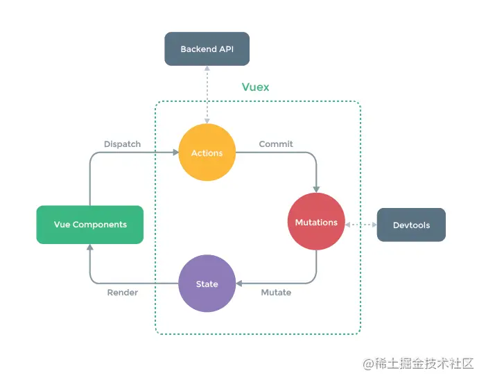

## Vue

https://juejin.cn/post/6844903918753808398

### 生命周期

`beforeCreate()` 在实例创建之间执行，数据未加载状态

`created()` 在实例创建、数据加载后，能初始化数据，`dom`渲染之前执行

`beforeMount()` 虚拟`dom`已创建完成，在数据渲染前最后一次更改数据

`mounted()` 页面、数据渲染完成，真实`dom`挂载完成

`beforeUpadate()` 重新渲染之前触发

`updated()` 数据已经更改完成，`dom` 也重新 `render` 完成,更改数据会陷入死循环

`beforeDestory()` 和 `destoryed()` 前者是销毁前执行（实例仍然完全可用），后者则是销毁后执行


**一般在哪个生命周期请求异步数据**

> 异步请求在哪个阶段都可以调用，因为会先执行完生命周期的钩子函数之后，才会执行异步函数，但如果考虑用户体验方面的话，在created 中调用异步请求最佳，用户就越早感知页面的已加载，毕竟越早获取数据，在 mounted 实例挂载的时候就越及时。


v-if 和 v-show 的差别

> `v-if` 是“真正”的条件渲染，因为它会确保在切换过程中条件块内的事件监听器和子组件适当地被销毁和重建。
>
> `v-if` 也是**惰性的**：如果在初始渲染时条件为假，则什么也不做——直到条件第一次变为真时，才会开始渲染条件块。
>
> 相比之下，`v-show` 就简单得多——不管初始条件是什么，元素总是会被渲染，并且只是简单地基于 CSS "display:none"
>
> 一般来说，`v-if` 有更高的切换开销，而 `v-show` 有更高的初始渲染开销。
>
> 因此，如果需要非常频繁地切换，则使用 `v-show` 较好；如果在运行时条件很少改变，则使用 `v-if` 较好。


### v-model

本质上是一个语法糖

```javascript
<input v-model="message" placeholder="edit me">
等价于 👇
<input v-bind:value="message" v-on:input="message=$event.target.value">
```

那么在自定义组件中，要想使用 `v-model` 绑定子组件的某个属性，那么子组件要提供两个点：

+ 该属性名为 `value` 
+ 想更新该属性时，需要出发事件 `input` 

```javascript
let Child = {
  template: '<div>'
  			+ '<input :value="value" @input="updateValue" placeholder="edit me">'
  			+ '</div>',
  props: ['value'],
  methods: {
    updateValue(e) {
      this.$emit('input', e.target.value)
    }
  }
}
```


### nextTick

先采用**微任务**并按照优先级优雅降级的方式实现**异步刷新**

**为什么是优先以微任务**？如下图所示


我们可以看到在每次页面渲染之前是会清空所有的微任务（micro）。这也就意味着，我们对于 Dom 的操作如果放在微任务之中是会让 UI 线程进行一次少的绘制（更快的展示在用户视野中）。

```javascript
let callbacks = []; //回调函数
let pending = false;
function flushCallbacks() {
  pending = false; //把标志还原为false
  // 依次执行回调
  for (let i = 0; i < callbacks.length; i++) {
    callbacks[i]();
  }
}
let timerFunc; 
// 先采用微任务并按照优先级优雅降级的方式实现异步刷新
if (typeof Promise !== "undefined") {
  // 如果支持promise
  const p = Promise.resolve();
  timerFunc = () => {
    p.then(flushCallbacks);
  };
} else if (typeof MutationObserver !== "undefined") {
  // MutationObserver 主要是监听dom变化 也是一个异步方法
  let counter = 1;
  const observer = new MutationObserver(flushCallbacks);
  const textNode = document.createTextNode(String(counter));
  observer.observe(textNode, {
    characterData: true,
  });
  timerFunc = () => {
    counter = (counter + 1) % 2;
    textNode.data = String(counter);
  };
} else if (typeof setImmediate !== "undefined") {
  // 如果前面都不支持 判断setImmediate
  timerFunc = () => {
    setImmediate(flushCallbacks);
  };
} else {
  // 最后降级采用setTimeout
  timerFunc = () => {
    setTimeout(flushCallbacks, 0);
  };
}

export function nextTick(cb) {
  callbacks.push(cb);
  if (!pending) {
    pending = true;
    timerFunc();
  }
}
```


### Virtual Dom

我们在视图渲染之前，把写好的 template 模板先编译成 VNode 并缓存下来，等到数据发生变化页面需要重新渲染的时候，我们把数据发生变化后生成的 VNode 与前一次缓存下来的 VNode 进行对比，**然后有差异的 VNode 对应的真实 DOM 节点就是需要重新渲染的节点**，最后根据有差异的 VNode 创建出真实的 DOM 节点再插入到视图中，最终完成一次视图更新

**virutal dom 的意义：**

- 提供一种简单对象去代替复杂的 dom 对象，从而优化 dom 操作
- 保存的是 js 对象，提供一个中间层，具备跨平台能力


### Diff 算法

[总结](https://juejin.cn/post/6994959998283907102)：**Diff算法是一种对比算法**。对比两者是`旧虚拟DOM和新虚拟DOM`，对比出是哪个`虚拟节点`更改了，找出这个`虚拟节点`，并只更新这个虚拟节点所对应的`真实节点`，而不用更新其他数据没发生改变的节点，实现`精准`地更新真实DOM，进而`提高效率`。

`patch` 要做的事：

1. 创建节点：新的 `VNode` 中有而旧的 `oldVNode` 中没有，就在旧的 `oldVNode` 中创建。
2. 删除节点：新的 `VNode` 中没有而旧的 `oldVNode` 中有，就从旧的 `oldVNode` 中删除。
3. 更新节点：新的 `VNode` 和旧的 `oldVNode` 中都有，就以新的 `VNode` 为准，更新旧的 `oldVNode` 。


[参考 2：比较同层级同类型节点的子节点](https://www.infoq.cn/article/udlcpkh4iqb0cr5wgy7f)


性能对比：

+ 使用虚拟DOM算法的损耗计算： 总损耗 = 虚拟DOM增删改+（与Diff算法效率有关）真实DOM差异增删改+（较少的节点）排版与重绘
+ 直接操作真实DOM的损耗计算： 总损耗 = 真实DOM完全增删改+（可能较多的节点）排版与重绘


### 渲染


## Vue3

响应式[原理](https://vuejs.org/guide/extras/reactivity-in-depth.html#how-reactivity-works-in-vue)


## vue-router

**hash**

通过 url 后面的 hash 实现路由，hash 值的变化，并不会导致浏览器向服务器发出请求，浏览器不发出请求，也就不会刷新页面。

另外每次 hash 值的变化，还会触发`hashchange` 这个事件，通过这个事件我们就可以知道 hash 值发生了哪些变化。

```javascript
window.addEventListener('hashchange', matchAndUpdate)
```


**history**：

通过 `window.history` 的两个 API `pushState` 和 `replaceState`，改变 url 地址且不会发送请求

需要后端配合


## vuex



## pinia

https://pinia.web3doc.top/introduction.html